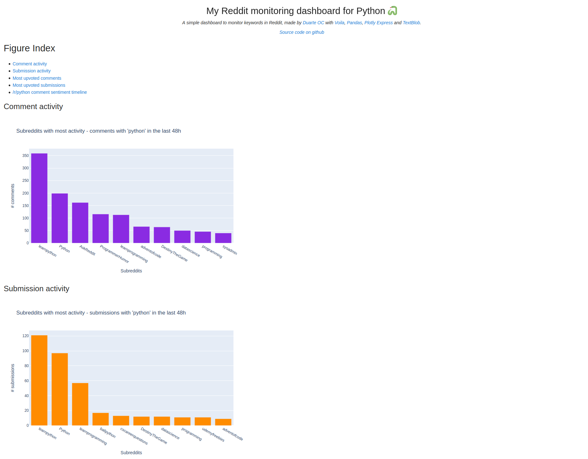
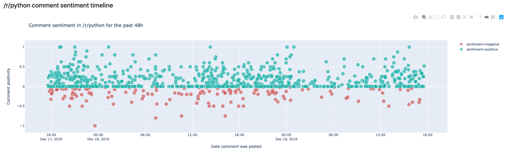

[](https://mybinder.org/v2/gh/duarteocarmo/interactive-dashboard-post/master?urlpath=%2Fvoila%2Frender%2Fnotebooks%2FDashboard.ipynb)  [](https://www.python.org/)  [](https://duarteocarmo.com)

# From notebook to web application 📔​+🔮=💥 

[Visit the original blog post!](https://duarteocarmo.com)

* [What is this? 🤔](#what-is-this-thinking)
* [Screenshots](#screenshots)
* [How do I run the notebook? 📔](#how-do-i-run-the-notebook-notebook_with_decorative_cover)
* [How do I run the dashboard? 📊](#how-do-i-run-the-dashboard-bar_chart)


## What is this? :thinking:

A blog post/tutorial for the [Practical Business Python](https://pbpython.com/) blog that teaches how to create web applications from jupyter notebooks and then deploy them. 

[Visit the live dashboard](https://mybinder.org/v2/gh/duarteocarmo/interactive-dashboard-post/master?urlpath=%2Fvoila%2Frender%2Fnotebooks%2FDashboard.ipynb) (might take a bit to load because of binder)


## Screenshots

[](https://mybinder.org/v2/gh/duarteocarmo/interactive-dashboard-post/master?urlpath=%2Fvoila%2Frender%2Fnotebooks%2FDashboard.ipynb)

[](https://mybinder.org/v2/gh/duarteocarmo/interactive-dashboard-post/master?urlpath=%2Fvoila%2Frender%2Fnotebooks%2FDashboard.ipynb)


## How do I run the notebook? :notebook_with_decorative_cover:

Clone the repo:

```bash
$ git clone https://github.com/duarteocarmo/interactive-dashboard-post.git
```

Navigate to it:

```bash
$ cd interactive-dashboard-post
```

Create a [virtual environment](https://virtualenv.pypa.io/en/latest/):

```bash
$ virtualenv env
```

Activate the environment:

```bash
$ . env/bin/activate
```

Install the requirements:

```bash
(env) $ pip install -r requirements.txt 
```

Launch [jupyter lab](https://jupyterlab.readthedocs.io/en/stable/):

```bash
(env) $ jupyter lab
```

It should launch automatically. If not, [check this](https://jupyterlab.readthedocs.io/en/stable/getting_started/starting.html).

🚨 **troubleshooting** 🚨

If the plotly express plots are not showing then try:

```bash
(env) $ jupyter labextension install @jupyterlab/plotly-extension
```

If you still have problems, follow [these instructions](https://plot.ly/python/getting-started/#jupyterlab-support-python-35).


## How do I run the dashboard? :bar_chart:

Follow the instructions above until you have the requirements installed, and then: 

```bash
(env) $ voila notebooks/Dashboard.ipynb
```

This should launch the dashboard in http://localhost:8866/
