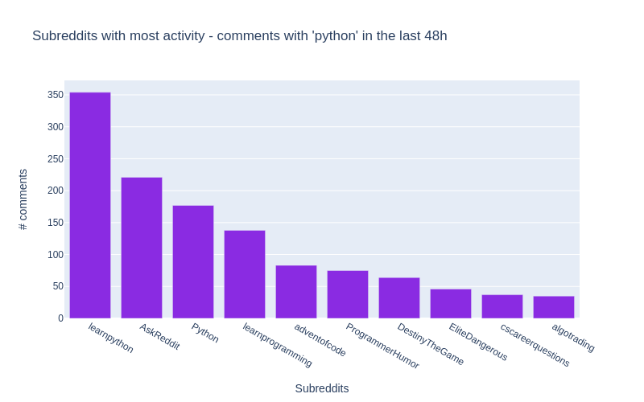
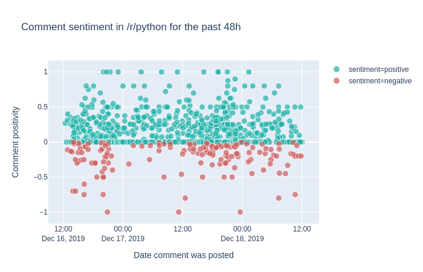

# Creating live dashboards from Jupyter Notebooks

### Introduction
I am pleased to have another guest post from [Duarte O.Carmo](https://duarteocarmo.com). He wrote  [series](https://pbpython.com/papermil-rclone-report-1.html) of [posts](https://pbpython.com/papermil-rclone-report-2.html) in July on report generation with Papermill that were very well received. In this article, he will explore how to use [voilà](https://github.com/voila-dashboards/voila) and [plotly express](https://plot.ly/python/plotly-express/) to convert a jupyter notebook into a standalone interactive web site.

### About Duarte 

Hey everyone! My name is [Duarte O.Carmo](https://duarteocarmo.com) and I'm a Consultant working at [Jabra](https://jabra.com) that loves working with python and data. Make sure to visit [my website](https://duarteocarmo.com/) if you want to find more about me :smile: 

### 1. The Goal

Jupyter notebooks are one of my favorite tools to work with data, they are simple to use, fast to set up, and flexible. However, they do have their disadvantages: source control, collaboration, and reproducibility are just some of them. As I illustrated in my prior post, I tend to enjoy [seing what I can accomplish with them](https://pbpython.com/papermil-rclone-report-1.html).

An increasing need is the sharing of our notebooks. Sure, you can export your notebooks to html, pdf, or even use something like [nbviewer](https://nbviewer.jupyter.org/) to share them. But what if your data changes constantly? What if every time you run your notebook, you expect to see something different? How can you go about sharing something like that? 

> But what if your data changes constantly? What if every time you run your notebook, you expect to see something different? How can you go about sharing something like that? 


In this article, I'll show you how to create a Jupyter Notebook that fetches live data, builds and interactive plot and then how to deploy it as a live dashboard. So that all you need to share with someone is a link. 

Let's have some fun with the data first. 

### 2. Getting live Reddit data

Reddit is a tremendous source of information, and there are a million ways to get access to it. 

Tweet at me if you have questionsMy favorite? A small API called pushshift, to which the [documentation is right here](https://github.com/pushshift/api). 

Let's say you wanted the most recent comments mentioning the word "python". In python, you could use requests to get a json version of the data:

```python
import requests

url = "https://api.pushshift.io/reddit/search/comment/?q=python"

request = requests.get(url)

json_response = request.json()
```

You can add a [multitude of parameters](https://github.com/pushshift/api#search-parameters-for-comments) to this request (in a certain subreddit, after a certain day, sorted by up votes, etc)

To make my life easier, I built a function that allows me to call this API as a function: 

```python
def get_pushshift_data(data_type, **kwargs):
    """
    Gets data from the pushshift api.
    
    data_type can be 'comment' or 'submission'
    The rest of the args are interpreted as payload.
    
    Read more: https://github.com/pushshift/api
    """
    
    base_url = f"https://api.pushshift.io/reddit/search/{data_type}/"
    payload = kwargs
    
    request = requests.get(base_url, params=payload)
    
    return request.json()
```

Using the `payload` parameter and `kwargs` I can then add any payload I wish as a function. For example,

```python
get_pushshift_data(data_type="comment",  	# give me comments
                   q="python", 				# that mention 'python'
                   after="48h", 			# in the last 48 hours
                   size=1000, 				# maximum 1000 comments
                   sort_type="score", 		# sort them by score
                   sort="desc")				# sort descending
```

returns the json response. Pretty sweet right? 

### 3. Analyzing the data

#### 3.1. In what subreddits does the word 'python' appear more? Introducing [Plotly Express](https://plot.ly/python/plotly-express/)

To answer the above question, we start by getting the data with our function:

```python
data = get_pushshift_data(data_type="comment",
                          q="python", 
                          after="48h", 
                          size=1000, 
                          aggs="subreddit")
```

The `aggs` keyword asks pushshift to return an aggregation into subreddits, which basically means, group the results by subreddit. ([read about it in the documentation](https://github.com/pushshift/api#using-the-subreddit-aggregation))

Since the json response is pretty nested, we'll need to navigate a bit inside of the dictionary. 

```python
data = data.get("aggs").get("subreddit")
```

And we transform the list of dictionaries returned into a pandas DataFrame, and get the top 10. 

```python
df = pandas.DataFrame.from_records(data)[0:10]
```

Here's what our dataframe looks like: 

|      | doc_count | key              |
| ---- | --------- | ---------------- |
| 0    | 352       | learnpython      |
| 1    | 220       | AskReddit        |
| 2    | 177       | Python           |
| .    | 139       | learnprogramming |

These are the names of the subreddits the word `python` appears more in their comments :tada::tada:!

Let's plot our results with the great [ploty express](https://nbviewer.jupyter.org/github/plotly/plotly_express/blob/gh-pages/walkthrough.ipynb) library. Plotly express is great, in my opinion if you want to:

- create figures quickly. :bullettrain_front:
- create figures that are a bit more interactive than [matplotlib](https://matplotlib.org/). :raised_hand_with_fingers_splayed:
- don't mind a bit more installation and (imo) a bit less documentation. :sweat:

Here's all the code you need:

```python
import plotly.express as px

px.bar(df,				# our dataframe
       x="key", 		# x will be the 'key' column of the dataframe 
       y="doc_count",	# y will be the 'doc_count' column of the dataframe
       title=f"Subreddits with most activity - comments with 'python' in the last 48h",
       labels={"doc_count": "# comments","key": "Subreddits"}, # the axis names
       color_discrete_sequence=["blueviolet"], # the colors used	
       height=500, 
       width=800)
```

Yes, perhaps a bit more verbose than matplotlib, but you get an interactive chart!



[Visit the notebook](https://github.com/duarteocarmo/interactive-dashboard-post/blob/master/notebooks/Dashboard.ipynb) for this article.

#### 3.2. What are the most up-voted comments with the word 'python'?

To answer this question, our function will again come in handy. Let's aggregate things a bit. Don't get scared, this is a one liner that will produce similar results to above:

```python
# get the data we need using the function 
data = get_pushshift_data(data_type="comment", q="python", after="7d", size=10, sort_type="score", sort="desc").get("data")

# we only care about certain columns
df = pandas.DataFrame.from_records(data)[["author", "subreddit", "score", "body", "permalink"]]

# we only keep the first X characters of the body of the comment (sometimes they are too big)
df['body'] = df['body'].str[0:400] + "..."

# we append the string to all the permalink entries so that we have a link to the comment
df['permalink'] = "https://reddit.com" + df['permalink'].astype(str)

# style the last column to be clickable and print
df.style.format({'permalink': make_clickable})
```

**sidenote**: to make a DataFrame column clickable you can can apply the following function to it:

 ```python
def make_clickable(val):
    """
    Makes a pandas column clickable by wrapping it in some html. 
    """
    return '<a href="{}">Link</a>'.format(val,val)
 ```

**end of sidenote**

The above code will return the top 10 most upvoted comments of the last 7 days:

|      | author           | subreddit            | score | body                                                  | permalink                                                    |
| ---- | ---------------- | -------------------- | ----- | ----------------------------------------------------- | ------------------------------------------------------------ |
| 0    | Saiboo           | learnpython          | 111   | Suppose you create the following python file calle... | [Link](https://reddit.com/r/learnpython/comments/eb57p0/what_is_the_point_of_name_main_in_python_programs/fb2ofbs/) |
| 1    | Kompakt          | ProgrammerHumor      | 92    | Some languages don't have switch statements...look... | [Link](https://reddit.com/r/ProgrammerHumor/comments/eb2lbc/stacking_if_else_statements_be_like/fb1vzhz/) |
| 2    | clown_world_2020 | MrRobot              | 47    | Just goes to show that Esmail isn't the only brill... | [Link](https://reddit.com/r/MrRobot/comments/eb3u62/esmails_influence_on_mac_quayles_process/fb2kipo/) |
| 3    | Leebertysauce    | AnimalsBeingBros     | 28    | They wont even be mad when the python decide to ta... | [Link](https://reddit.com/r/AnimalsBeingBros/comments/eb0ux7/capybara_is_a_foster_parent_for_a_group_of_husky/fb25ons/) |
| 4    | Kompakt          | ProgrammerHumor      | 23    | Yep it's true, and depending on the design of the ... | [Link](https://reddit.com/r/ProgrammerHumor/comments/eb2lbc/stacking_if_else_statements_be_like/fb253g9/) |
| 5    | niceboy4431      | Cringetopia          | 23    | I have a theory (someone prove me wrong if you kno... | [Link](https://reddit.com/r/Cringetopia/comments/eakrbs/i_hate_these_channels_so_much/fauiic1/) |
| 6    | kingguru         | Denmark              | 22    | Brug af Python: **+1** Brug af Python 3: **+2** ...   | [Link](https://reddit.com/r/Denmark/comments/eb0mzj/debatkulturen_på_rdenmark/fb1b27a/) |
| 7    | MintyAroma       | totalwar             | 20    | We really need Bretonnian Men-At-Arms shouting Mon... | [Link](https://reddit.com/r/totalwar/comments/eb1eyf/wait_thats_illegal/fb1vq6j/) |
| 8    | aspiringtobeme   | gifsthatkeepongiving | 19    | Amazing. Brought [this Monty Python clip](https://... | [Link](https://reddit.com/r/gifsthatkeepongiving/comments/eaqml0/watch_a_new_kid_every_time/faw7ne5/) |
| 9    | CrimsonSpooker   | TwoBestFriendsPlay   | 19    | “Why can’t Three Houses be gritty and “realistic” ... | [Link](https://reddit.com/r/TwoBestFriendsPlay/comments/eb3f6m/i_dont_think_there_are_too_many_of_these_but/fb2nisj/) |

And you can click the link column to be taken right into the comment. Hooray! :tada: 

#### 3.3. What is the sentiment in /r/python across time? introducing [TextBlob](https://textblob.readthedocs.io/en/dev/) 

Alright, the final analysis is a bit more complicated. We want to see the sentiment in the [/r/python](https://reddit.com/r/python) subreddit in some sort of time line. 

First, we already now how to retrieve the most up voted comments of the past 2 days:

```python
# get the data with our function
data = get_pushshift_data(data_type="comment",
                          after="2d", 
                          size=1000, 
                          sort_type="score", 
                          sort="desc", 
                          subreddit="python").get("data")

# define a list of columns we want to keep
columns_of_interest = ["author", "body", "created_utc", "score", "permalink"]

# transform the response into a dataframe
df = pandas.DataFrame.from_records(data)[columns_of_interest]
```

This gives us a pandas DataFrame with the columns specified in `columns_of_interest`. But how the hell do we get the sentiment of every comment? 

Enter [TextBlob](https://textblob.readthedocs.io/en/dev/). A simple library that makes it ridiculously easy to get the sentiment of a sentence. Textblob returns two values, the sentiment **polarity** (-1 is negative; 0 is neutral; and 1 is positive) and the sentiment **subjectivity** (0 is objective and 1 is subjective)

Here's an example:

```python
import textblob

sentence1 = "Portugal is a horrible country. People drive like crazy animals."
print(textblob.TextBlob(sentence1).sentiment)
# -> Sentiment(polarity=-0.8, subjectivity=0.95)
# negative and subjective

sentence2 = "Portugal is the most beautiful country in the world because beaches face west."
print(textblob.TextBlob(sentence2).sentiment)
# -> Sentiment(polarity=0.675, subjectivity=0.75)
# positive and less subjective
```

Read more about the library [here](https://textblob.readthedocs.io/en/dev/). 

Now that we know how to extract sentiment from a piece of text, we can easily create some other columns for our DataFrame of comments:

```python
# create a column with sentiment polarity
df["sentiment_polarity"] = df.apply(lambda row: textblob.TextBlob(row["body"]).sentiment.polarity, axis=1)

# create a column with sentiment subjectivity
df["sentiment_subjectivity"] = df.apply(lambda row: textblob.TextBlob(row["body"]).sentiment.subjectivity, axis=1)

# create a column with 'positive' or 'negative' depending on sentiment_polarity
df["sentiment"] = df.apply(lambda row: "positive" if row["sentiment_polarity"] >= 0 else "negative", axis=1)

# create a column with a text preview that shows the first 50 characters
df["preview"] = df["body"].str[0:50]

# take the created_utc parameter and tranform it into a datetime column
df["date"] = pandas.to_datetime(df['created_utc'],unit='s')

```

Finally, it's time to plot our figure with the help of Plotly Express:

```python
px.scatter(df, x="date", # date on the x axis
               y="sentiment_polarity", # sentiment on the y axis
               hover_data=["author", "permalink", "preview"], # data to show on hover
               color_discrete_sequence=["lightseagreen", "indianred"], # colors to use
               color="sentiment", # what should the color depend on? 
               size="score", # the more votes, the bigger the circle
               size_max=10, # not too big 
               labels={"sentiment_polarity": "Comment positivity", "date": "Date comment was posted"}, # axis names
               title=f"Comment sentiment in /r/python for the past 48h", # title of figure
          )
```

And here's the output!



In this view, we can see the comments made in /r/python in the last 48 hours. We can see that most comments are rather on the positive side, but some are also negative. In your own notebook you'll notice that you can hover over the comments and read the preview to see why they were classified as negative or positive. 

The cool thing here is that if you run the same script tomorrow, you'll get a different output. 

So how can we have this in some place that "automatically" is updated whenever we see it? 

### 4. Creating a live dashboard with [Voilà](https://github.com/voila-dashboards/voila)

Voilà has a simple premise: "*Voilà turns Jupyter notebooks into standalone web applications.*"

**[Let's back up a bit, and get everything you need running in your system. First step is to have a working setup with everything above, for that, follow these instructions right here](https://github.com/duarteocarmo/interactive-dashboard-post)**.

Once that is done, you should be able to launch the dashboard with:

```bash
(env) $ voila notebooks/Dashboard.ipynb
```

Now, you should be able to see a web like application in a new tab in your browser from the notebook we created! 

Feel free to modify this notebook according to your interests. You'll notice that I have created some general variables in the first notebook cell, so you can fire up Jupyter Lab, and modify them and see what comes out!

Here are the general modifiable cells:

```python
COMMENT_COLOR         = "blueviolet" 	# color for your comment graph
SUBMISSION_COLOR      = "darkorange"	# color for your submission graph
TEXT_PREVIEW_SIZE     = 240				# how long should the preview be? 
TERM_OF_INTEREST      = "python"		# maybe you are interested in some other term? 
SUBREDDIT_OF_INTEREST = "python"		# maybe you are interested in some other subreddit?
TIMEFRAME             = "48h"			# you can define another timeline
```

Once you have modified your dashboard, you can launch Voilà again to see the results. 

The most important thing about Voilà is that every time it runs, it actually re-runs your whole code, which yes, makes things a bit slow, but also means that the results get updated every time the page is refreshed! :tada:

### 5. Deploying your notebook to the web

#### 5.1 First option: Using [binder](https://mybinder.org/)

Binder helps you turn a simple GitHub repo into an interactive notebook environment. They do this by using docker images to reproduce your GitHub repo's setup. 

We don't really care about all that. We just want to publish our Voilà dashboard. To do that, follow these steps:

- [Create a public GitHub repo](https://help.github.com/en/github/getting-started-with-github/create-a-repo)
- Add the notebooks you want to publish as dashboards to it
- Add a `requirements.txt` file just as I have in the [example repo](https://github.com/duarteocarmo/interactive-dashboard-post/blob/master/requirements.txt) with all of your dependencies. 
- Go to [mybinder.org](https://mybinder.org/)
- In the `GitHub` field add your repo's URL.
- In the `GitHub branch, tag, or commit` field, add "master", otherwise, you probably know what you are doing. 
- In the `Path to a notebook field ` add `/voila/render/path/to/notebook.ipynb` the `path/to/render` should be the location of your notebook in your repo. In the [example](https://github.com/duarteocarmo/interactive-dashboard-post), this results in `voila/render/notebooks/Dashboard.ipynb`
- In the `Path to a notebook field ` toggle `URL` (instead of the default `file` option)
- Hit `launch` 
- Your dashboard will automatically launch :open_mouth: :tada: 
- You can share the link with others and they will have access to the dashboard as well. 

[Here is the running example of our reddit dashboard.](https://hub.gke.mybinder.org/user/duarteocarmo-in--dashboard-post-qzsxjbm1/voila/render/notebooks/Dashboard.ipynb?token=oChcyyPqTv2zblb6OMFoMw) 

#### 5.2 Second Option: Using an ubuntu server in a hacky way with tmux :see_no_evil:

:warning: **WARNING: This option is not 100% safe, so make sure to only use it for testing or proof of concepts, particularly if you are dealing with sensitive data!** :warning:

If you want to have your dashboard running on a typical URL (such as mycooldash.com for example), you probably want to deploy it on a Linux server. 

Here are the steps I used to accomplish that:

- Set up your virtual private server - [this](https://www.linode.com/docs/getting-started/) Linode guide is a good start.
- Make sure port 80 (the regular http port) is open 

```shell
$ sudo iptables -A INPUT -p tcp --dport 80 -j ACCEPT
```

- Once you have your repo in GitHub or somewhere else, clone it to your server. 

```shell
$ git clone https://github.com/your_username/your_awesome_repo.git
```

- You should already have python 3 installed. Try typing `python3` in your console. If that fails then [these instructions will help you](https://www.digitalocean.com/community/tutorials/how-to-install-python-3-and-set-up-a-local-programming-environment-on-ubuntu-16-04).
- Make sure you can run your dashboard, by [creating a virtual environment and installing the dependencies](https://github.com/duarteocarmo/interactive-dashboard-post#running-the-notebook). 
- Now, if you type in your console the Voilà command, and specify the port:

```shell
(env) $ voila YourNoteBook.ipynb --port=80
```

You can probably navigate to your server's IP and see the dashboard. However, as soon as you exit your server, your dashboard will stop working. We are going to use a nifty trick with a tool called [tmux](https://en.wikipedia.org/wiki/Tmux).

Tmux is a "terminal multiplexer" (wow, that's a big word). It basically allows us to create multiple terminal sessions at the same time, and then (yes you guessed it), keep them running indefinitely. If this sounds confusing, let's just get to it. 

- Install tmux:

```shell
$ sudo apt-get install tmux
```

- Once installed we create a new terminal session:

```shell
$ tmux new voila
```

- You are now inside a new terminal session. Let's get voila running there.

```shell
$ cd my_repo 			# navigate to the repo
$ . env/bin/activate	# activate the environment
(env) $ voila MyNotebook.ipynb --port=80 # start the dashboard on port 80
```

- You should see the dashboard in your browser
- And now, for the magic, in your terminal hit `ctrl` + `b` and then `d` on your keyboard. This will "[detach](https://www.linode.com/docs/networking/ssh/persistent-terminal-sessions-with-tmux/#attach-and-detach-from-a-tmux-session)" you from that terminal where Voilà is running.
- You are now back to your original terminal session. Notice that your dashboard is still running. This is because your 'voila' terminal session is still running. 
- You can see it by listing the terminal sessions with:

```shell
$ tmux ls
```

- And then attach to it via:

```
$ tmux attach voila
```

- And you'll see your Voilà logs outputting. 

This is arguably a bit of a hack to have things running, but it works - so no complaints there. 

Tmux is an awesome tool, and you should definitely [learn more about it here](https://www.linode.com/docs/networking/ssh/persistent-terminal-sessions-with-tmux/#attach-and-detach-from-a-tmux-session).

#### 5.3 Using Heroku or Google Cloud Platform

There are a million ways of deploying, and [Voilà also has good documentation on these](https://voila.readthedocs.io/en/stable/deploy.html).

### 6. Conclusion

That was a long post! But we are finally done! Let's summarize everything we learned:

- We learned how to transform an API endpoint into a function with *kwargs
- We learned how to analyze reddit data with python and [Plotly Express](https://plot.ly/python/plotly-express/)
- We learned how to analyze sentiment from sentences with [TextBlob](https://textblob.readthedocs.io/en/dev/)
- We learned how to transform a jupyter notebook into a dashboard using [Voilà](https://github.com/voila-dashboards/voila).
- We learned how to deploy those dashboards with [Binder.org](https://mybinder.readthedocs.io/en/latest/index.html)
- We learned how to use [tmux](https://en.wikipedia.org/wiki/Tmux) to deploy these kinds of tools in a server. 

That was a lot of stuff, and probably there are a lot of bugs in my notebook, or explanation so make sure to:

- Visit the [GitHub repo](https://github.com/duarteocarmo/interactive-dashboard-post#running-the-notebook) where both the code and post are stored.
- If there is something wrong in the code please feel free to [submit an issue](https://github.com/duarteocarmo/interactive-dashboard-post/issues) or a [pull request](https://github.com/duarteocarmo/interactive-dashboard-post/pulls).
- [Tweet at me if you have questions](https://twitter.com/duarteocarmo)!
- Visit my website if you want to learn more about my work :smile:

Hope you enjoyed it! 